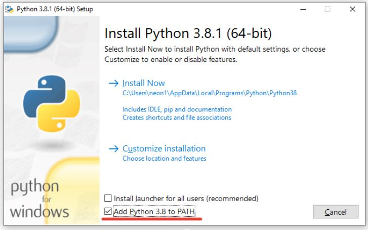
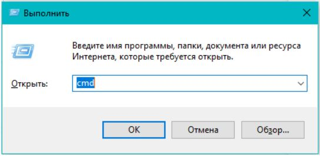
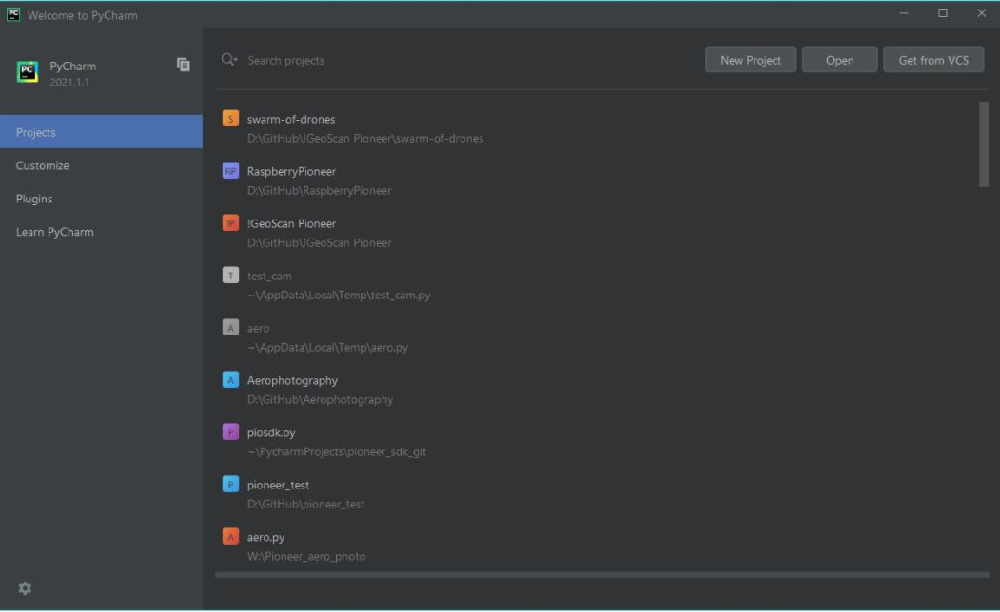
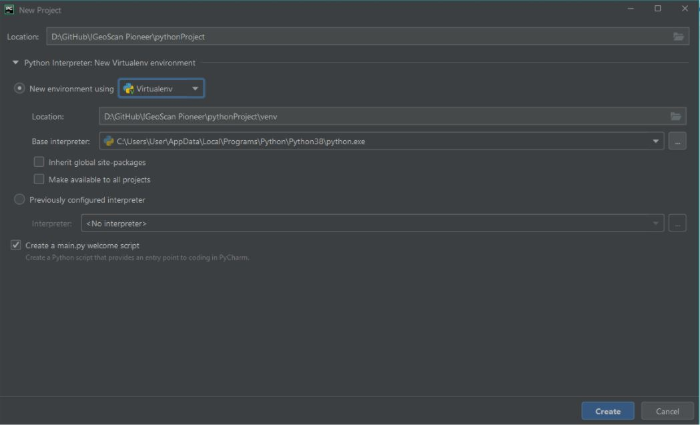
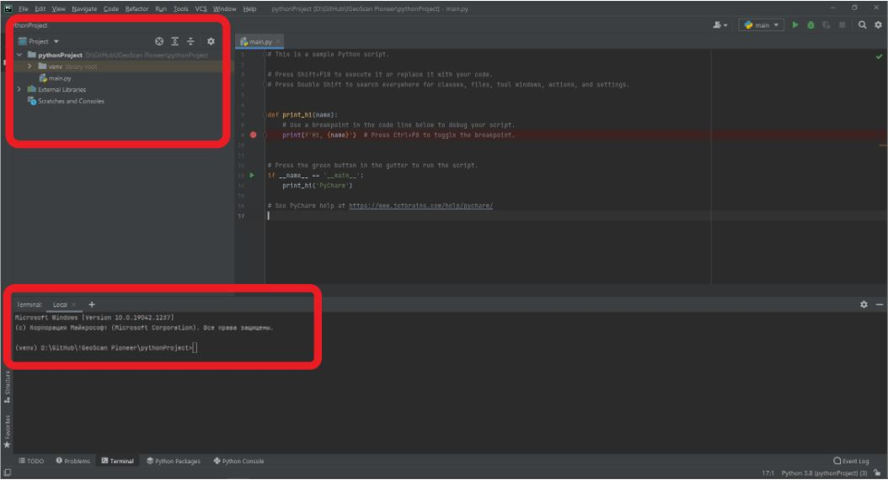
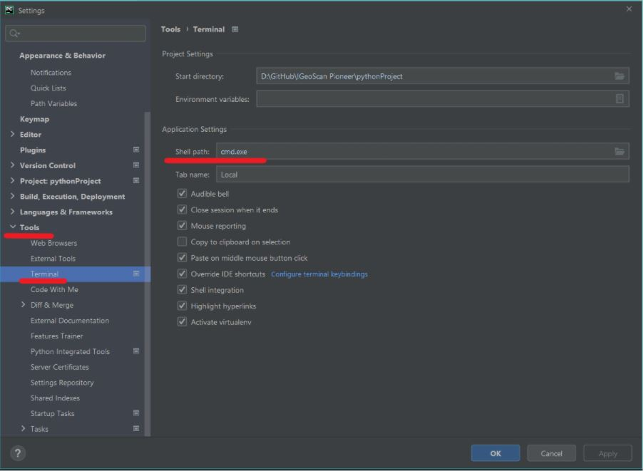
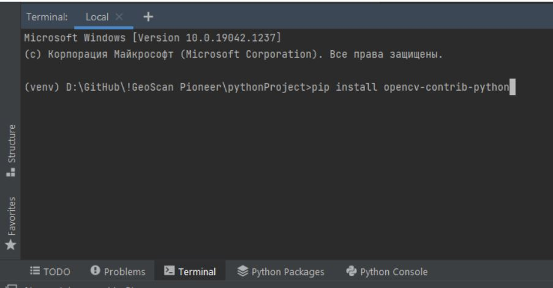

# PyCharm и Python

# Оглавление
[Введение](#introduction)
1. [PyCharm](#PyCharm)
2. [Установка](#Install)
    1. [Установка Python](#Install Python)
    2. [Установка PyCharm](#Install PyCharm)

3. [Создание проекта](#Create priject)
    1. [На что стоит обратить внимание](#Create priject1)
    2. [Устранение проблем](#Create priject2)

4. [Установка библиотек в проект](#Install lib)
    1. [Создание списка установленых библиотек](#Install lib1)


## Введение <a name="introduction"></a>
Целью этого урока является рассмотрение базового инструментария интегрированной
среды разработки PyCharm.
* Что это и зачем?
* Как этим пользоваться?
* Как устанавливать библиотеки?
* Как импортировать свой проект?

## PyCharm <a name="PyCharm"></a>
Что же это собственно такое? **PyCharm** – это интеллектуальная Python IDE 
с полным набором средств для эффективной разработки на языке Python. 
Выпускается в двух вариантах – бесплатная версия **PyCharm Community Edition** (ее-то мы и будем рассматривать) 
и платная PyCharm Professional Edition (а ее нет). 
PyCharm выполняет проверку кода в реальном времени, автодополнение, 
в том числе основываясь на информации, полученной во время исполнения кода. 
И позволяет работать с Git`ом.

## Установка <a name="Install"></a>
### Установка Python <a name="Install Python"></a>
Прежде всего нужно начать с установки python на ваш компьютер.
[Ссылка на скачивание](https://www.python.org/).
Обратите внимание на то, что при установки python необходимо выбрать следующий пункт:



После установки Python необходимо перейти к установкам следующих пакетов для создания 
виртуального окружения (что это такое и зачем будет сказано чуть позже).

Для этого необходимо открыть консоль. Жмем **win + R** и вводим **cmd**.



После открытия консоли выполняем следующие команды:

```
pip install virtualenv
pip install virtualenvwrapper-win
```

### Установка PyCharm <a name="Install Python"></a>
Скачиваем PyCharm Community Edition.
[Ссылка на скачивание](https://www.jetbrains.com/ru-ru/pycharm/download/#section=windows).


## Создание проекта <a name="Create priject"></a>
При открытии программы нас встречает стартовое окно, в котором можно увидеть следующие вкладки:
* Созданные ранее проекты, чтобы их быстро открыть;
* Настройки среды;
* Установка разных плагинов;
* Обучение от PyCharm



Создаем новый проект:



Обратите внимание на выбор окружения.Создавая проект для Python нужно выбрать его окружение. 
Проще говоря ограничить видимость мест, в которых он будет искать установленные библиотеки 
для проекта. К чему это может привести?

* У вас есть два проекта, которые должны использовать какую-то стороннюю библиотеку. 
  Но в проекте 1 вам нужна более старая версия библиотеки, а проекте 2 более новая. 
  Но вот беда, устанавливая стандартным образом библиотеки разных версий они будут 
  стирать друг друга и всегда будет оставаться только 1 библиотека. 
  Но нужно-то, чтобы у каждого проекта была своя собственная библиотека.
  
* Если вы пользуетесь не своим компьютером, то вам могут просто запретить доступ к папке, в которой хранятся библиотеки.

Что же делать? Нужно как-то ограничить видимость проекта. 
Или же создать **виртуальное окружение**. Что же оно нам дает?

* В каждый новый проект библиотеки ставятся индивидуально. 
  У проекта А всегда будут нужные только ему библиотеки и проект Б никогда 
  не увидит библиотеки проекта А.
  
* Для передачи проекта другому пользователю достаточно будет выполнить лишь одну команду, 
  которая создаст список используемых библиотек. А пользователю, соответственно, 
  нужно будет выполнить одну команду с этим списком, для установки всех библиотек.
  

### На что стоит обратить внимание <a name="Create priject1"></a>

После создания проекта открывается следующие окно:


Слева расположено дерево открытого проекта. Обратите внимание, что в нем должна появиться 
папка с названием “venv” это та папка, куда будут устанавливаться все библиотеки.

Внизу можно увидеть открытый терминал, в котором тоже указано, что директория, в которой 
мы находимся, является виртуальной средой.

Если чего-то из этого нет, то виртуальное окружение не создано и все поставленные библиотеки 
будут ставиться не для проекта, а для всей системы.

### Устранение проблем <a name="Create priject2"></a>

Создали вы проект, вроде, все сделали правильно, а в терминале нет упоминания о том, что этот проект виртуальный. 
Что же делать?

Для решения необходимо в PyCharm открыть настройки: ctrl + alt + s и перейти во вкладку Tools, далее во вкладку Terminal 
и убедиться, что в графе “Shell path” выбрано cmd.



После этого создайте новый проект.


## Установка библиотек в проект <a name="Install lib"></a>

Все библиотеки будут ставиться через 
```
pip install
```

Предположим, что решили вы создать проект, в котором планируете использовать библиотеки технического зрения OpenCV.
Например, для установки OpenCV выполняем в терминале команду:
```
pip install opencv-contrib-python
```



После установки можно выполнить импорт установленной библиотеки в проект и запустить пример, использующий ее.

### Создание списка установленых библиотек <a name="Install lib1"></a>

Вся прелесть использования виртуальной среды начинается в тот момент, 
когда вы хотите поделиться своим проектом с кем-то. Если посмотреть на размер папок в проекте, 
то можно обнаружить, что папка, содержащая библиотеки весит очень много, и не хотелось бы это загружать.

Но решение есть! Достаточно просто создать список используемых библиотек, чтобы тот, кому вы отдали проект, просто установил их сам. 
Вам останется лишь скинуть ваши скрипты и текстовый файл со списком библиотек.

Для создания такого списка необходимо в терминале выполнить команду: 
```
pip freeze > requirements.txt
```

После выполнения данной команды в корне вашего проекта будет создан текстовый файл requirements.txt, в котором будут перечислены все ваши установленные библиотеки.

Но как же установить все эти библиотеки из этого файла? Все просто, нужно выполнить в терминале команду: 
```
pip install -r requirements.txt.
```
Причем при открытии проекта, который вы скачали и в котором есть requirements.txt, PyCharm сразу понимает, что это должен быть проект с виртуальной оболочкой. 
